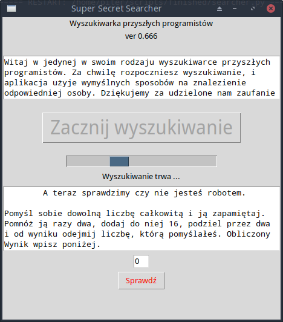

## 🔍 **Super Secret Searcher** 
to nietypowa wyszukiwarka... przyszłych programistów.
Nie używa AI, nie łączy się z bazą danych — opiera się wyłącznie na Twoim umyśle i odrobinie poczucia humoru.

To lekki, żartobliwy projekt pokazujący, że programowanie może być przyjemnością —  
a przyszły programista może być już... właśnie przed ekranem 😄

---

## 📦 Wymagania

- Python 3.x  
- tkinter (wbudowany w większość instalacji Pythona)

---

## 🖼️ Zrzut ekranu



---

## ▶️ Uruchomienie

Po prostu (w przypadku dowolnego linuxa)
```bash
python sssearcher.py
```

Lub pobierz aplikację dla systemu Windows

💾 **[Kliknij tutaj, aby pobrać aplikację dla Windows](./searcher.exe)**  


## 🎨 Źródła ikon

- [Magnifying Glass icon](https://icons8.com/icon/Y6AAeSVIcpWt/search) by [Icons8](https://icons8.com)


---
> Stworzone z humorem i pasją do kodu – przez twórcę niezależnego.
